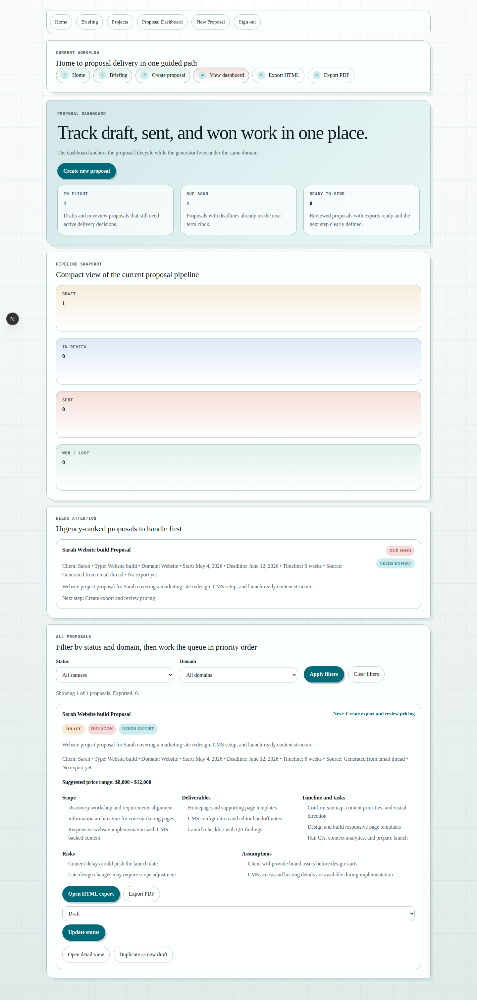
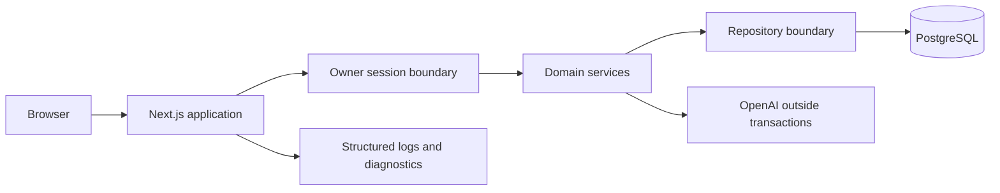

# Project Command Center

Project Command Center is a single-owner workspace for managing client projects, turning saved context into proposals, and tracking delivery tasks. It runs on Next.js and PostgreSQL, with authenticated production access, migrations, backup and restore tooling, release controls, and browser-tested workflows.



## What it does

- Creates, prioritizes, searches, archives, and restores projects.
- Keeps tasks and proposals attached to their project.
- Generates proposals from saved project or briefing context.
- Saves proposal edits as versions and exports proposal HTML or PDF.
- Imports and exports portable workspace data.
- Reports liveness, readiness, build identity, and recent operation failures.

## Architecture



Production reads and writes use PostgreSQL through the repository layer. External AI calls finish before database transactions begin. Database constraints protect ownership and source-reference relationships. Demo storage exists only in local development and starts empty.

## Local setup

Requirements:

- Node.js 22 or newer
- PostgreSQL 16 or newer

Setup:

```bash
cp .env.example .env.local
npm install
npm run prisma:generate
npm run prisma:migrate:deploy
npm run dev
```

Open `http://localhost:3000`. Set `APP_ACCESS_PASSWORD` and `SESSION_SECRET` to test owner sign-in locally.

Docker is optional. The application and test scripts work with a normal PostgreSQL installation. GitHub Actions uses an isolated PostgreSQL service for migration and browser tests.

## Configuration

| Variable              | Purpose                                                                                           |
| --------------------- | ------------------------------------------------------------------------------------------------- |
| `DATABASE_URL`        | Main PostgreSQL connection string. Required in production.                                        |
| `BACKUP_DATABASE_URL` | Direct PostgreSQL connection used by the backup workflow.                                         |
| `APP_ACCESS_PASSWORD` | Password for the single-owner workspace. Required in production.                                  |
| `SESSION_SECRET`      | Separate secret used to sign owner sessions. Required in production.                              |
| `OPENAI_API_KEY`      | Enables external proposal generation. The local draft builder is used when absent in development. |
| `BUILD_ID`            | Release identifier shown by `/api/diagnostics`. CI uses the commit SHA.                           |
| `DEMO_STORAGE_ROOT`   | Optional directory for an isolated local demo store. Ignored by production workflows.             |

Use [.env.preview.example](.env.preview.example) and [.env.production.example](.env.production.example) as deployment checklists. Keep preview and production databases, passwords, secrets, and API keys separate.

## Data modes

Production requires a migrated database and never falls back to fixtures or local files. Local development without `DATABASE_URL` opens an empty demo workspace. Choose **Load demo workspace** on the home page when you want the sample proposal. This control returns `404` in production.

The briefing still uses local Gmail and Calendar adapters until real provider authentication is configured. The interface labels this behavior rather than presenting it as live integration data.

## Testing

Run the same local checks used by CI:

```bash
npm run verify
```

The command checks formatting, lint rules, TypeScript, 26 unit and integration tests, and the production build. PostgreSQL and browser checks are separate because they require a running database and application:

```bash
TEST_DATABASE_URL=postgresql://... npm run test:migrations
TEST_BASE_URL=http://localhost:3106 APP_ACCESS_PASSWORD=... npm run test:e2e:phase3
TEST_BASE_URL=http://localhost:3106 APP_ACCESS_PASSWORD=... npm run test:e2e:phase4
TEST_BASE_URL=http://localhost:3106 APP_ACCESS_PASSWORD=... npm run test:e2e:phase5
TEST_BASE_URL=http://localhost:3106 APP_ACCESS_PASSWORD=... npm run test:e2e:phase7
```

The Phase 7 browser check scans the home, project, and proposal pages against WCAG A and AA rules. It also verifies keyboard access, mobile overflow, and a median warm-load target below three seconds.

## Operations

- [Release, rollback, and hotfix runbook](docs/phase-6-release-runbook.md)
- [Incident response and monitoring](docs/phase-5-incident-runbook.md)
- [Backup and restore procedure](docs/phase-2-backup-and-restore.md)
- [Durable persistence design](docs/phase-2-durable-persistence-design.md)
- [Production operating contract](docs/production-operating-contract.md)

`/api/live` confirms that the process is running. `/api/ready` checks the database and migrations. Authenticated `/api/diagnostics` reports the build ID, uptime, readiness, and recent operation failures without returning request content or secrets.

## Release flow

Every pull request runs quality checks, clean-database migrations, a production build, and the primary browser workflows. The preview workflow builds one deployment candidate and smoke-tests its build ID. Production promotion checks that same candidate before moving the production alias. The rollback workflow restores a previously recorded deployment and verifies it.

The [Phase 7 acceptance report](docs/phase-7-production-ux-evidence.md) records the responsive, accessibility, performance, demo, and manual workflow evidence for this branch.
