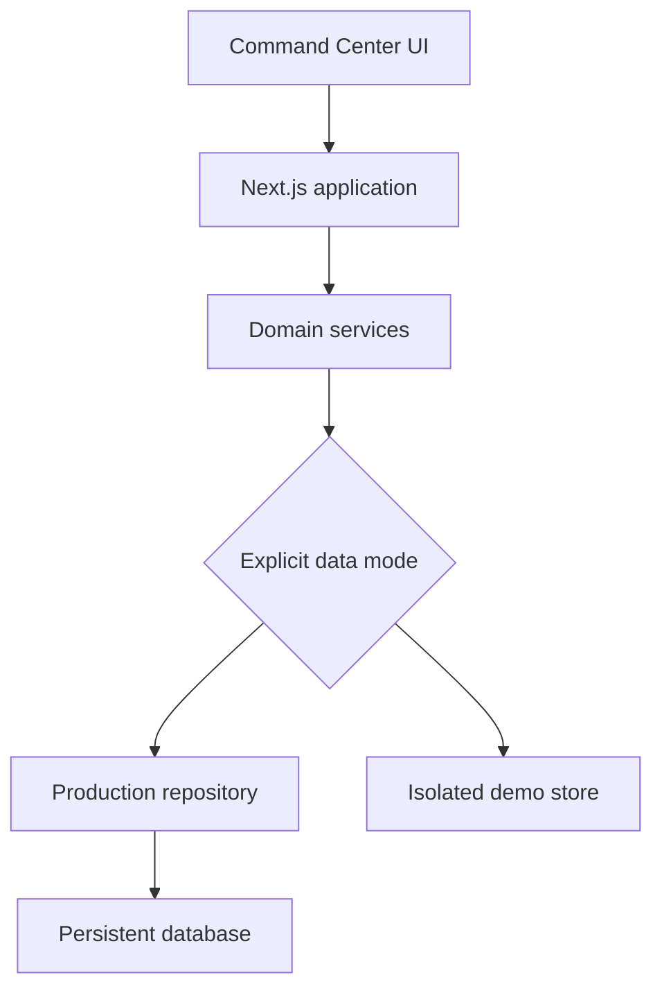

# Production Operating Contract

Last updated: 2026-09-19

## Target

Project Command Center is becoming a real, single-user production application. The cyberpunk interface stays; the data, deployment, recovery, and operating workflows must become production-grade.

Fully operational means:

- Real projects, proposals, and tasks survive restarts and deployments.
- Production never falls back to demo fixtures.
- Every visible action works end to end.
- Deployment, migration, backup, restore, rollback, and monitoring are verified.
- The application is secure for its chosen exposure model.
- Demo mode remains available but is isolated, labeled, and resettable.
- Recruiters can see documented production evidence, not only screenshots.

## Operating Decisions

- Initial production target: a single-owner workspace.
- Exposure model: private and authenticated. Production requires the owner password and session secret even when it runs on a private network.
- Public writable deployment rule: serve the application over HTTPS so its secure owner session cookie remains protected in transit.
- Production data source: persistent database only.
- Demo data source: isolated demo store only.
- Test and development modes may use fixtures, mocks, or local stores, but those paths must not be reachable from production mode.
- Strict mode isolation: production cannot import, read, seed from, or fall through to demo data.

## Data Ownership

- The operator owns all production records.
- Supported production entities include projects, proposals, tasks, proposal seeds, exports, and owner audit records as they are implemented.
- Records need stable IDs, timestamps, ownership fields where relevant, and clear archive/delete behavior.
- Production workflows must use repository boundaries instead of direct fixture, local-storage, or in-memory state access.

## Retention And Recovery

- Production records are retained until explicitly archived or deleted.
- Backups must run on a documented schedule before the production release is considered complete.
- Restore must be tested from a clean environment.
- Rollback must include both application rollback and database migration risk handling.
- Deployment verification reports should be kept as portfolio evidence.

## Mode Definitions

| Mode        | Purpose                    | Data Source                       | Demo Fallback                       |
| ----------- | -------------------------- | --------------------------------- | ----------------------------------- |
| Production  | Real single-user operation | Persistent database               | Never allowed                       |
| Demo        | Recruiter-safe walkthrough | Isolated demo store               | Native mode, labeled and resettable |
| Test        | Automated validation       | Test database, mocks, or fixtures | Allowed only inside tests           |
| Development | Local implementation work  | Local database or demo store      | Explicit only                       |

## Phase 0: Production Contract And Architecture

Work:

- Keep this operating contract current.
- Decide and document the active exposure model before any public writable deployment.
- Document production, demo, test, and development mode behavior.
- Record short ADRs for persistence, mode isolation, access model, backup/restore, and deployment target decisions as they are finalized.
- Update architecture diagrams when repository boundaries or data flow changes.

Exit gate:

- Production architecture and operational acceptance checklist are documented.
- Authentication remains unnecessary only when access is local or otherwise private.
- A public writable deployment requires owner authentication.

## Phase 1: Deployment Verification

Phase 1 is closed.

Status as of 2026-08-27:

- Local automated gates pass: `npm test`, `npm run build`, and `npm run build:vercel`.
- `/api/health` now reports deployment readiness from database configuration, migration readiness, and demo-fallback policy.
- Production-like runtime blocks demo fallback when the configured database is unavailable.
- Local development with no database remains an explicit demo mode.
- Vercel production verification cleared the production database blocker: Neon Postgres is reachable, 3 migrations are present with none pending, and `/api/proposals` returns a database-backed record.
- Current production deploys `/api/health` successfully with database mode, migrations ready, and `demoFallbackAllowed: false`.
- Controlled production proposal `cmt3cs0xp0003ld04lk2q3owx` survived redeployment.
- Current production deployment `dpl_DaHm2Y8xDBZPkKMqT4YTcC8yBHEm` is `READY` at commit `4892f1d74f521ce17142afa4ab93986057386704`.
- Rollback drill completed on 2026-08-27: production rolled back to `dpl_ACEGU85muZczSezt5XBK3AxGxn1o`, health passed, controlled database record `cmt3cs0xp0003ld04lk2q3owx` survived, production rolled forward to `dpl_DaHm2Y8xDBZPkKMqT4YTcC8yBHEm`, and health passed again.
- No Prisma rollback, migration reset, or destructive database command was run during the rollback drill.

Work:

- Deploy a production-mode build using production configuration.
- Validate required environment variables and fail startup when configuration is incomplete.
- Verify database connection and migration execution.
- Add health and readiness checks.
- Exercise create, save, reopen, edit, export, restart, and redeploy workflows.
- Confirm that no seeded records appear in production.
- Test deployment rollback.
- Produce a repeatable deployment-verification report.

Exit gate:

- A clean environment can be deployed from documented instructions.
- Real records survive restart and redeployment.
- Production contains zero implicit demo fallback behavior.

Current blockers:

- The local `npm run prisma:migrate:deploy` Prisma `P1012` is a local-shell configuration issue; Vercel successfully injects `DATABASE_URL` during `npm run build:vercel`.
- No Phase 1 blocker remains. GitHub issue #2 was closed after the successful rollback and roll-forward drill.

## Phase 2: Durable Persistence And Data Integrity

Design source: `docs/phase-2-durable-persistence-design.md`. The design keeps external AI calls outside database transactions and requires database-level owner consistency, mandatory source-reference uniqueness, and real Postgres migration tests.

Work:

- Route all production reads and writes through one repository boundary.
- Eliminate remaining local-storage, in-memory, or seeded-store dependencies from production workflows.
- Define database constraints, relationships, timestamps, stable IDs, and delete/archive behavior.
- Use transactions for multi-record operations.
- Add versioned migrations and migration tests.
- Add data export and import.
- Implement scheduled backups, retention rules, and a tested restore procedure.

Exit gate:

- Every production entity is durable.
- Invalid or partially written state is prevented.
- A fresh database can migrate successfully.
- A backup can be restored and verified.

## Phase 3: Complete Real Workflows

Implementation branch: `phase-3-complete-real-workflows`.

Verification completed on 2026-09-19 against a clean PostgreSQL database:

- Created, edited, prioritized, filtered, searched, archived, and recovered projects through the UI.
- Created, ordered, completed, and reopened project tasks.
- Generated a proposal from saved project context and preserved the project relationship.
- Edited the saved proposal, created version history, reopened the detail page, and downloaded the HTML export.
- The scripted browser test covers the project, task, proposal, version, export, search, and archive path.
- The five-migration clean install and upgrade test passes against PostgreSQL.

Work:

- Project creation, editing, status changes, prioritization, archiving, search, and filtering.
- Proposal generation from actual project context.
- Proposal editing, saving, reopening, versioning, and HTML export.
- Task creation, assignment to projects, priority ordering, completion, and history.
- Explicit relationships among projects, proposals, and tasks.
- Validation, loading, empty, error, and recovery states for every action.
- Remove buttons or controls that do not perform real operations.

Exit gate:

- End-to-end tests cover each primary workflow.
- The UI can be operated without modifying files or database rows manually.
- No core workflow depends on a fixture or hardcoded success response.

## Phase 4: Access And Security Boundary

Implementation branch: `phase-4-access-security`.

Verification completed on 2026-09-19 against a fresh PostgreSQL database:

- Anonymous page requests redirect to sign-in, and anonymous API requests return `401`.
- Incorrect passwords fail without creating a session. Correct passwords create a signed, HTTP-only, same-site session.
- Cross-origin mutations return `403` before reaching an application route.
- Security headers block framing, outside scripts, and unnecessary browser permissions.
- Project creation writes an owner-scoped audit event, and sign-out removes access.
- The dependency scan reports zero vulnerabilities.
- The six-migration clean install and upgrade test passes against PostgreSQL.
- Unit tests, the standalone type check, the production build, and the browser security test pass.

Work:

- Write a small threat model.
- Validate all server-side inputs and escape exported content.
- Protect mutations against unauthorized or cross-origin requests.
- Prevent secrets and sensitive errors from reaching the client.
- Add safe production headers and dependency scanning.
- Disable demo-only routes and reset operations in production.
- Add an owner audit trail for important mutations.
- If hosted publicly, add owner authentication and session protection.

Exit gate:

- The chosen access model is deliberate and tested.
- Production cannot expose demo controls, secrets, or unrestricted mutations.
- Security checks run in CI.

## Phase 5: Reliability And Operations

Implementation branch: `phase-5-reliability-operations`.

Verification completed on 2026-09-19 with a disposable PostgreSQL database:

- Correlated JSON logs record request IDs, operation IDs, status codes, and durations without request bodies or client content.
- Liveness stayed available while PostgreSQL was stopped, readiness returned `503`, and database-backed work failed with a safe response and request ID.
- Readiness and database-backed work recovered after PostgreSQL restarted without restarting the application.
- Malformed project input returned `400` and the diagnostics endpoint reported uptime, build, readiness, and the last failed operation.
- A deliberately failed migration transaction left no partial table behind.
- A custom-format backup restored into a clean database with matching user, project, and audit-event counts.
- The manual browser test created and reopened a real recovery-drill project, then verified authenticated diagnostics.

Work:

- Add structured logs with request and operation identifiers.
- Capture application errors without recording sensitive content.
- Add uptime, readiness, database, and failed-operation monitoring.
- Define alert thresholds and an incident runbook.
- Add graceful error handling and retry behavior where safe.
- Test database outage, migration failure, malformed input, restart, rollback, and restore scenarios.

Exit gate:

- Failures are visible, diagnosable, and recoverable.
- Backup and rollback drills pass.
- The operator does not need source-code debugging to identify common failures.

## Phase 6: CI/CD And Release Controls

Implementation branch: `phase-6-release-controls`.

Verification completed on 2026-09-19 with a disposable PostgreSQL database and a local release candidate:

- Formatting, linting, type checking, 24 unit and integration tests, the dependency scan, and the production build passed.
- All six migrations passed against a clean PostgreSQL database, including upgrade, constraint, and rollback checks.
- The Phase 3 workflow, Phase 4 security test, and Phase 5 reliability test passed in sequence with owner access enabled.
- The release smoke test verified liveness, readiness, authenticated project reads, diagnostics, and build ID `phase6-manual-build`.
- A smoke test with the wrong build ID exited with an error, which confirms that the promotion job stops before moving the alias.
- Manual browser testing confirmed sign-in and diagnostics. Diagnostics reported the expected build ID and a ready database.
- GitHub issue #7 records the failed first run and the test fixes: canonical localhost use, deterministic sign-in, sequential execution, and waiting for archive writes before navigation.

CI now checks formatting, linting, types, tests, dependencies, clean-database migrations, browser workflows, and the production build. Preview and production have separate environments. Production promotion checks the deployed candidate and its build ID before moving the production alias. The rollback workflow can restore a recorded deployment.

Work:

- Gate changes on formatting, linting, type checking, unit tests, integration tests, end-to-end tests, and production builds.
- Test migrations against a clean database.
- Separate preview and production configuration.
- Require a smoke test before production promotion.
- Document release, rollback, and hotfix procedures.
- Generate a version/build identifier visible in diagnostics.

Exit gate:

- Releases are repeatable and auditable.
- A failed gate cannot silently promote a deployment.
- The previous working release can be restored.

## Phase 7: Production UX And Portfolio Evidence

Work:

- Preserve and refine the existing futuristic cyberpunk interface.
- Complete responsive behavior, accessibility, keyboard navigation, and contrast checks.
- Improve first-run empty states without silently creating demo data.
- Add explicit "Load demo workspace" behavior outside production mode.
- Measure page performance and remove unnecessary loading delays.
- Update README setup, operations, architecture, testing, screenshots, and deployment evidence.
- Record a short real-workflow demonstration using an isolated demo environment.

Exit gate:

- Accessibility and performance targets pass.
- A new operator can deploy and use the application from the documentation.
- The portfolio demonstrates real persistence, deployment, testing, recovery, and workflows.

## Recommended Execution Queue

1. Keep the production operating contract and architecture decisions current.
2. Run deployment verification.
3. Harden persistence, migrations, backup, and restore.
4. Complete end-to-end project, proposal, and task workflows.
5. Establish the access and security boundary.
6. Add monitoring and recovery procedures.
7. Formalize CI/CD and releases.
8. Finish production UX and portfolio documentation.
9. Run the final production-readiness acceptance review.
